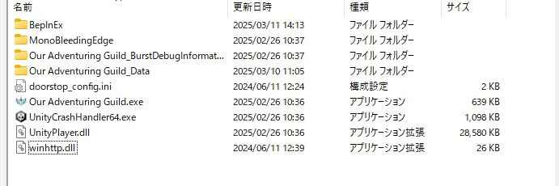
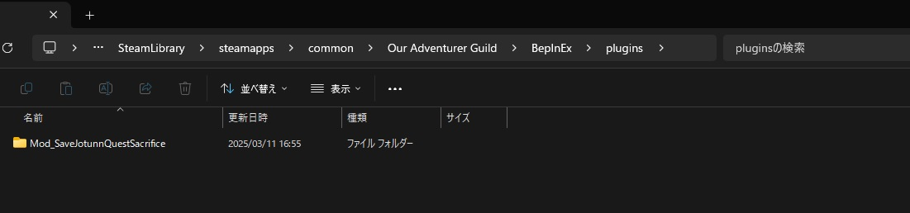
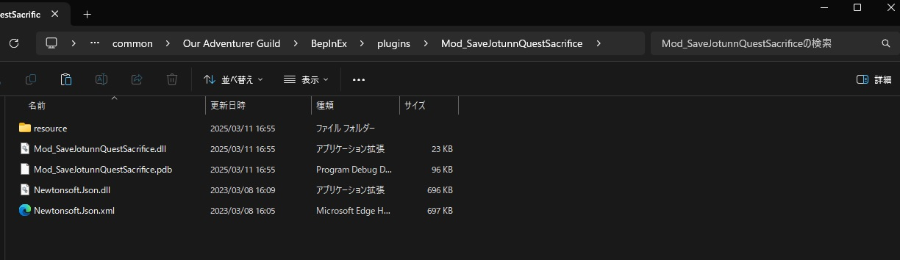

# Mod_OurAdventurerGuild
Our Adventurer Guild のMod群です。  
誰も作ってなかったのでVortex対応もしました。  
神ゲーなのでみんな布教用に100本くらい買ってください。  

ゲームリンク
https://store.steampowered.com/app/2026000/Our_Adventurer_Guild/
  
# 導入方法
Vortex経由でModを入れるか、手動で入れてください。  
それぞれの方法を下記に記載します。  

## Vortex経由で入れる方法
まずは[これ](https://github.com/yu-ituki/Mod_OurAdventurerGuild/releases/tag/vortex) を入れてください。 
その後に、Releases等に上がっているZipをVortexに放り込めば完了です。  

## 手動で入れる方法
まずは[BepInEx v5.4.23.2](https://github.com/BepInEx/BepInEx/releases/tag/v5.4.23.2) をダウンロードしてきてください。  
バージョンは大きく変わらなければ他のものでも多分大丈夫です。（保証はしない）  
そうしたらダウンロードしたBepInExをゲームのインストールフォルダ直下に展開してください。  
展開するとこんな感じでOur Adventuring Guild.exeがあるフォルダにBepInExフォルダやwinhttp.dllなどが置かれるはずです。  
（winhttp.dllはたまにウイルスチェッカーに引っかかるっぽいので何かあったら気にせず除外設定してください）  

その後、BepInEx/plugins フォルダ以下に[releases](https://github.com/yu-ituki/Mod_OurAdventurerGuild/releases)に上がっているzipを展開してください。  
基本的にはそれだけで動作します。  

展開するとこんな感じになります。  

# 各Modのビルド手順
## 開発環境
* Windows 11
* Visual Studio 2022
* .NET Framework 4.8

## ビルド手順
※事前に前述の導入方法に記載されているBepInExを入れておいてください。  
（Vortex拡張機能を使用した場合は自動的にBepInExが入った状態になります）  

1. config.bat を編集し、自身のゲームインストールフォルダのパスを記載してください。  
2. config.bat を叩いてください。  
3. VisualStudio2022等でslnを開いてビルドしてください。  

基本的にはこれだけでビルドが出来て、ビルド後は自動的にBepInEx/pluginsフォルダにModがコピーされます。  

# 新規Modの作成簡易ガイド
Mod作成用のテンプレートを用意しました。  
このプロジェクトをCloneするかダウンロードしてきて、ModTemplateフォルダとLibsフォルダのみを使用します。  
詳細な手順やテンプレートは[このページ](https://github.com/yu-ituki/Mod_OurAdventurerGuild/tree/main/ModTemplate) に記載してあります。  
その他不明点があれば[こちら](https://x.com/ituki_yu)に質問してきてください。  
あと良さげなModが出来たら自分も使いたいのでください。  

# ライセンスと免責
MITライセンスです。  
あと何も責任は取りません。  
